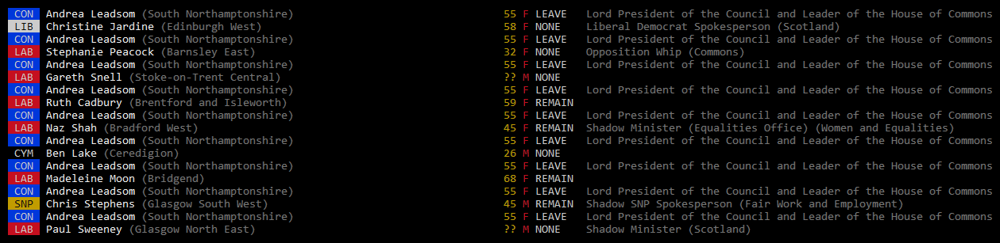

# mplist
**A tool for listing mps based on data from http://www.data.parliament.uk/**

<p align="center">
  
</p>


## Install

```
npm install
```

## Update MP Database

```
npm run update
```

## List Live from Commons

```
npm start
```